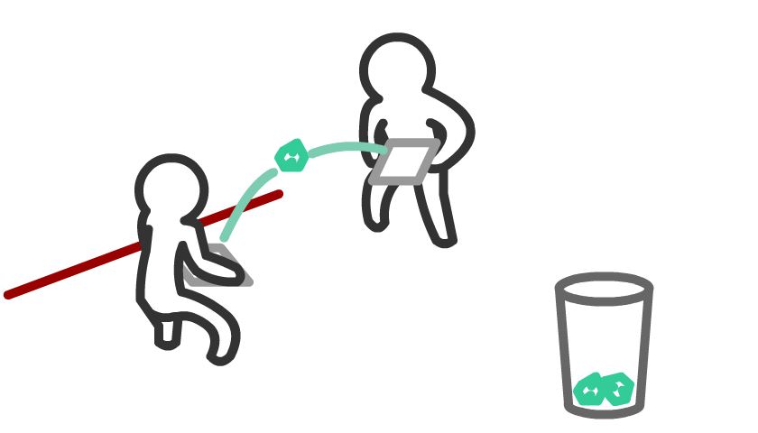
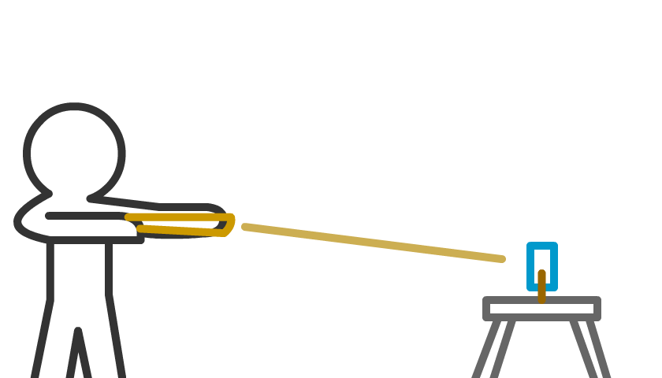
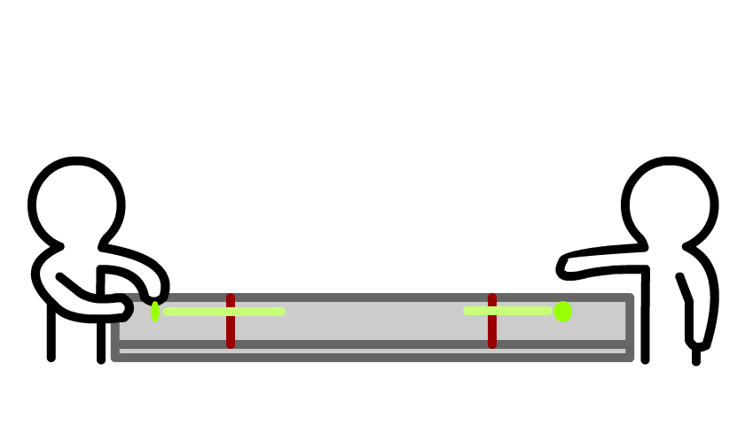
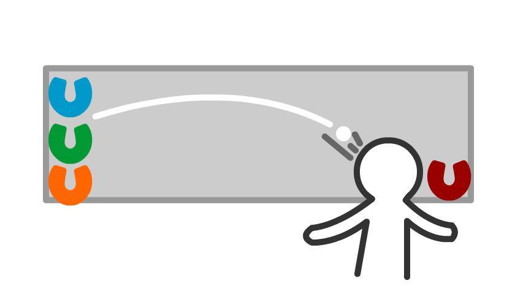
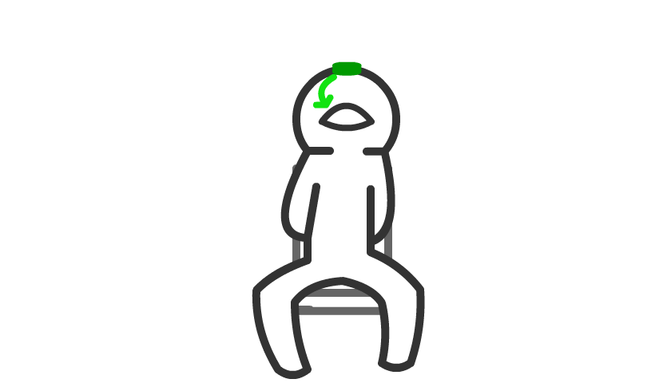
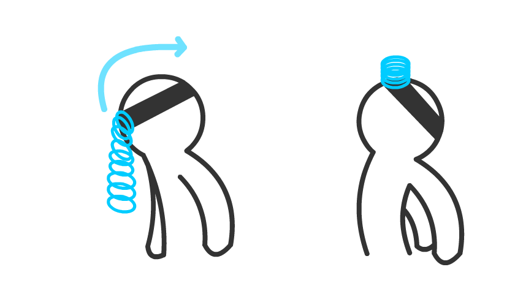
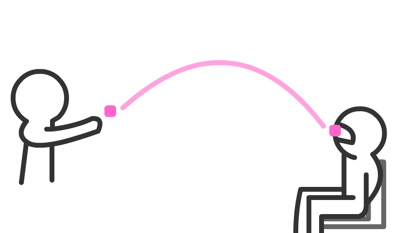
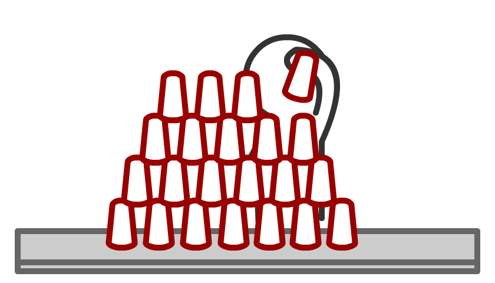
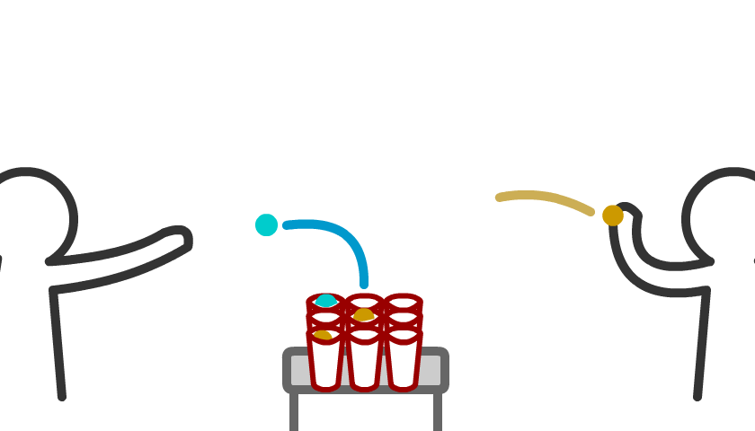

# Discord Games

# Challenges

## 1. Bounce Relay

|Type|Relay|
| --- | --- |
| **Scoring** | Timer |

#### Rules

Six cups lined up in a line on a table. Person A starts from the beginning, and tries to bounce a ping pong ball into a cup. Each time you make one, you move onto the next cup.

Once you get the last cup, person B must do the same thing

## 2. Office Tennis

|Type|Co-op|
| --- | --- |
| **Scoring** | Score |

#### Rules

Both players hold a cutting board and start behind a marked line. The goal is to bounce a crumbled up piece of paper back and forth towards a waste basket, and hit it in.

Anytime the paper touches the ground, have to start from behind the line again.

Score is how many you can get in the basket in 60 seconds

## 3. Rubberband Range

|Type|Single|
| --- | --- |
| **Scoring** | Score |

#### Rules

*work in progress*

Playing cards are held up with a clothespin. You have a certain amount of shots to knock down as many cards as you can.

Some cards will be further away and worth more points.

Score is best score between two teammates

## 4. Quarter Catch

|Type|Co-op|
| --- | --- |
| **Scoring** | Timer |

#### Rules

One player flicks, the other catches. The goal is to spin a coin across an area so it's spinning on it's side, and the other play has to put their finger on it and catch it on the table so it's still standing on it's edge

## 5. Horseplay

|Type|Relay|
| --- | --- |
| **Scoring** | Score |

#### Rules

A table is setup slightly slanted with 4 horseshoes. A ping pong ball is in the furthest most horseshoe.

Player needs to try to blow the ping pong ball up the slanted table and into one of the horseshoes on the left

Anytime somebody scores or if the ball hits the floor, the next teammate goes

Best score for 60 seconds

## 6. Cookie Play

|Type|Single|
| --- | --- |
| **Scoring** | Timer |

#### Rules

Sit in a chair, and put an oreo on your forehead. The goal is to catch it in your mouth without using your hands

If you drop the oreo, you have to restart on your forehead

## 7. Slinky Face

|Type|Single|
| --- | --- |
| **Scoring** | Timer |

#### Rules

Headband with slinky on, start leaning forward. Sling your head back and try to catch it on your forehead

## 8. Marshmellow Launch

|Type|Co-op|
| --- | --- |
| **Scoring** | Score |

#### Rules

Teammates stand across the room. Player A throws a marshmellow and Player B tries to catch it in their mouth.

Scoring is most marshmellows caught in 60s

## 9. Stack Attack Relay

|Type|Relay|
| --- | --- |
| **Scoring** | Timer |

#### Rules

Player A needs to stack 28 cups (7 cup base), and then collapse them back on top of each other.

When Player A finishes, hand the cups to Player B and have them do the same.

## 10. Ping Tac Toe

|Type|Head-to-Head|
| --- | --- |
| **Scoring** | Tournament |

#### Rules

9 cups in the middle of the table, two teams go against each other and try to play Tic-Tac-Toe in the middle by throwing ping pong balls into the cups. No turn based, once you start you just throw